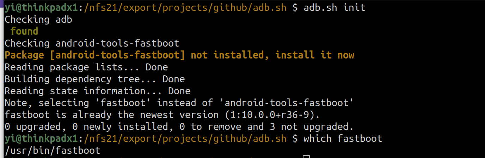
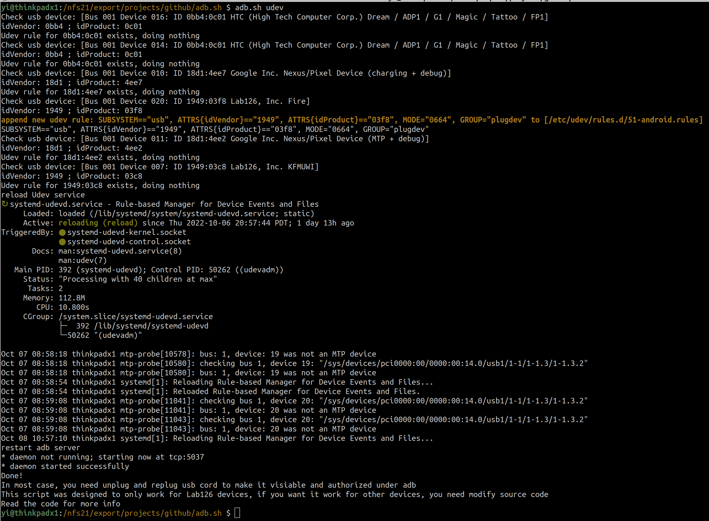
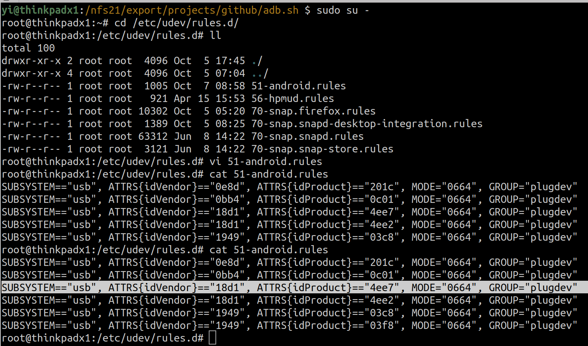
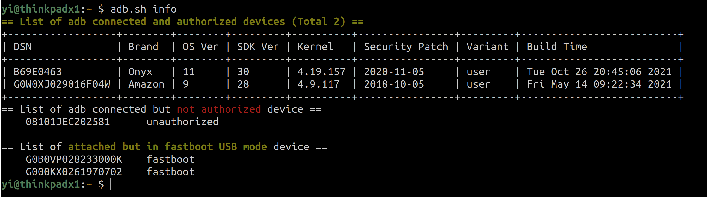
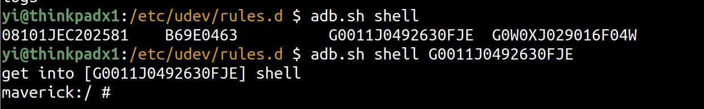
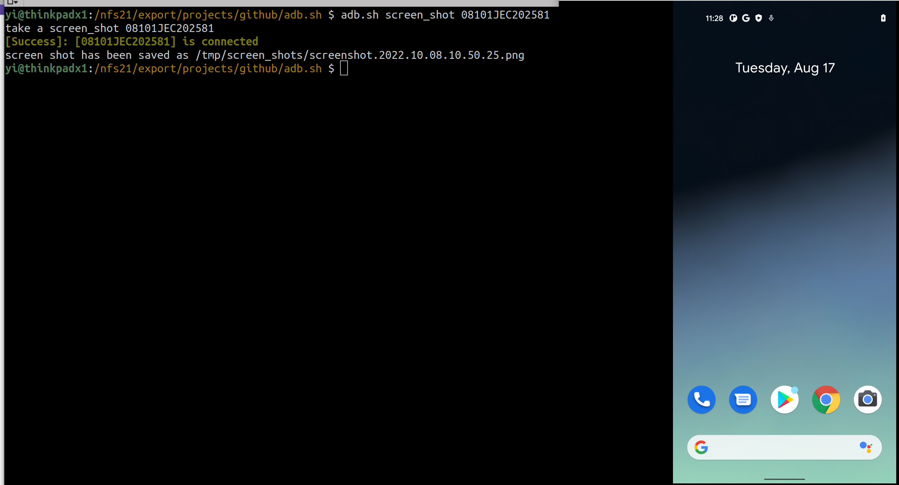
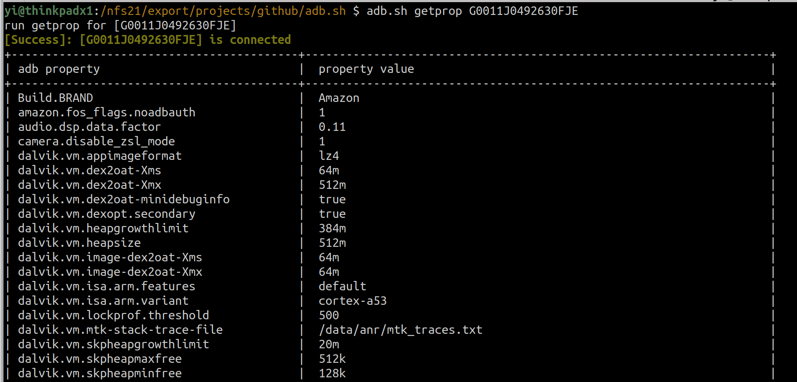
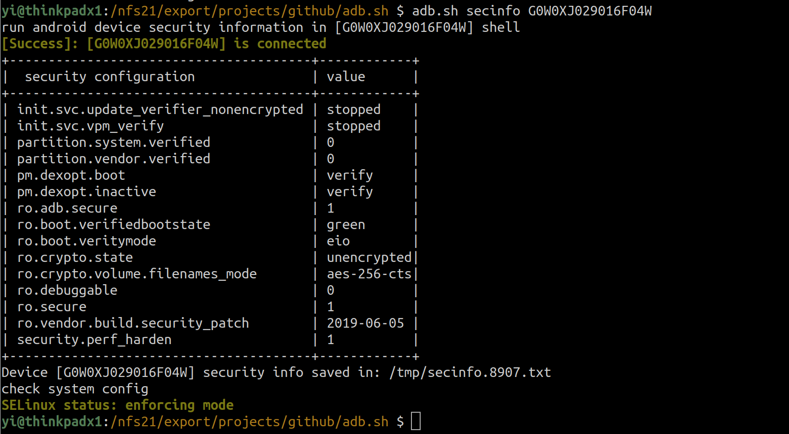

# adb.sh
\<working in progress...>

In a nutshell, adb.sh is a shell script that extends android adb functionality. The purpose of this script is to provide shortcuts to make the interaction with an android device more effective.

Assuming the user knows [how Android adb works](https://developer.android.com/studio/command-line/adb), the script 
**adb.sh** will provide Linux terminal shortcuts with Double-\<TAB\> (**\<TAB\> \<TAB\>**) for the following operations:

* **init** : automatically install **adb** and **fastboot** binary for you
* **udev** : automatically check the connected USB devices, create udev rules, and insert them into */etc/udev/rules.d/51-android.rules* file, then reload the rules
* **devices**: print a text table to list connected android devices
* **shell**: shortcut of **adb -s \<dsn\> shell** -- the beauty is you don't have to enter the **-s \<dsn\>** yourself, the auto-complete feature, \<tab\>\<tab\>, will find it for you
* **logs** : shortcut of **adb -s \<dsn\> logcat** 
* **screen_shot**: take a screenshot, save it in the local file system
* **getprop**: shortcut of **adb -s \<dsn\> shell getprop**, the property file will be saved as text file in local file system
* **secinfo**: a comprehensive list of security configuration on the device. It combines data from system property and current kernel status

## Install
There is no actual "install" for this tool set. 

Download it as a zip file, unzip it and add the local file location to your $PATH variable and you are good to go. The only trick is to enable <TAB> completion: you need to add the following lines in your $HOME/.bashrc file

```bash
adbsh_home="$HOME/adb.sh/"
export PATH=$PATH:$adbsh_home
source $adbsh_home/_adbsh_complete
```
  
## Knowledge in Code
### Adding udev rules for USB debugging Android devices
To set it up manually, the following procedures apply
  1. lsusb and locate the id string, like **ID idVendor:idProduct**
```bash
yi@thinkpadx1:/nfs21/export/projects/github/adb.sh $ lsusb | sort
Bus 001 Device 001: ID 1d6b:0002 Linux Foundation 2.0 root hub 
Bus 001 Device 005: ID 04f2:b614 Chicony Electronics Co., Ltd Integrated Camera 
Bus 001 Device 007: ID 1949:03c8 Lab126, Inc. KFMUWI
Bus 001 Device 008: ID 06cb:009a Synaptics, Inc. Metallica MIS Touch Fingerprint Reader 
Bus 001 Device 010: ID 18d1:4ee7 Google Inc. Nexus/Pixel Device (charging + debug)
Bus 001 Device 011: ID 18d1:4ee2 Google Inc. Nexus/Pixel Device (MTP + debug)
Bus 001 Device 012: ID 056a:5193 Wacom Co., Ltd Pen and multitouch sensor 
Bus 001 Device 014: ID 0bb4:0c01 HTC (High Tech Computer Corp.) Dream / ADP1 / G1 / Magic / Tattoo / FP1
Bus 001 Device 015: ID 058f:9540 Alcor Micro Corp. AU9540 Smartcard Reader
Bus 001 Device 016: ID 0bb4:0c01 HTC (High Tech Computer Corp.) Dream / ADP1 / G1 / Magic / Tattoo / FP1
Bus 001 Device 017: ID 04f2:b615 Chicony Electronics Co., Ltd Integrated IR Camera
Bus 001 Device 018: ID 8087:0aaa Intel Corp. Bluetooth 9460/9560 Jefferson Peak (JfP)
Bus 001 Device 020: ID 1949:03f8 Lab126, Inc. Fire
Bus 002 Device 001: ID 1d6b:0003 Linux Foundation 3.0 root hub 
```
  2. generate udev rules like the following
```text
SUBSYSTEM=="usb", ATTRS{idVendor}=="18d1", ATTRS{idProduct}=="4ee7", MODE="0664", GROUP="plugdev"
```
  3. save the rule in file  **/etc/udev/rules.d/51-android.rules**
  4. reload udev rules by execute: ** service udev reload **
The shortcut adb.sh udev is simple execute the above 4 steps. The following is my udev rules file
```bash
yi@thinkpadx1:/nfs21/export/projects/github/adb.sh $ cat /etc/udev/rules.d/51-android.rules 
SUBSYSTEM=="usb", ATTRS{idVendor}=="0e8d", ATTRS{idProduct}=="201c", MODE="0664", GROUP="plugdev"
SUBSYSTEM=="usb", ATTRS{idVendor}=="0bb4", ATTRS{idProduct}=="0c01", MODE="0664", GROUP="plugdev"
SUBSYSTEM=="usb", ATTRS{idVendor}=="18d1", ATTRS{idProduct}=="4ee7", MODE="0664", GROUP="plugdev"
SUBSYSTEM=="usb", ATTRS{idVendor}=="18d1", ATTRS{idProduct}=="4ee2", MODE="0664", GROUP="plugdev"
SUBSYSTEM=="usb", ATTRS{idVendor}=="1949", ATTRS{idProduct}=="03c8", MODE="0664", GROUP="plugdev"
SUBSYSTEM=="usb", ATTRS{idVendor}=="1949", ATTRS{idProduct}=="03f8", MODE="0664", GROUP="plugdev"
```

### Android security properties
  #### security in getprop
  [security getprop properties](https://github.com/yizhang2020/adb.sh/blob/main/adbsh.util.sh#L209)
  ```text
   209       | grep "ro.adb.secure\|ro.secure\|ro.vendor.build.security_patch\|ro.debuggable\|ro.crypt\|veri\|security.perf_harden" \
  ```
  
## Screen Shots 
### adb.sh init


### adb.sh udev





### adb.sh devices


### adb.sh shell


### adb.sh screen_shot


### adb.sh getprop


### adb.sh secinfo

